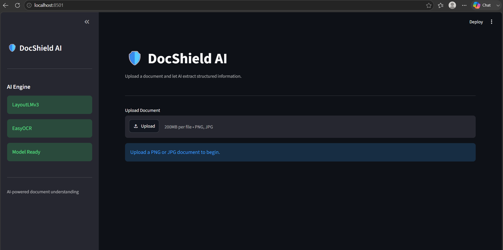

# 🛡️ DocShield AI

### Robust Multimodal Document Intelligence Under Real-World Degradation

DocShield AI is a research-oriented Document AI system built around **LayoutLMv3** for multimodal document understanding. The project combines document images, OCR text, spatial layout, and token-level semantic predictions into an end-to-end inference pipeline, while also providing a controlled framework for evaluating model robustness under realistic document degradation.

The project is designed around two complementary goals:

1. **Build a practical document-understanding application** with OCR, LayoutLMv3 inference, entity extraction, confidence analysis, visualization, and structured export.
2. **Study robustness** by measuring how document corruptions such as noise, blur, brightness degradation, JPEG compression, and rotation affect multimodal document understanding.

---

## 🖼️ Screenshot



*Streamlit interface — original document, AI-annotated prediction, confidence breakdown, and JSON/CSV export.*

---

## ✨ Highlights

- 🔍 **EasyOCR-based text detection**
- 📦 **Normalized OCR bounding boxes**
- 🤖 **LayoutLMv3 token classification**
- 🧠 **FUNSD-based document understanding**
- 🏷️ **BIO-aware entity extraction**
- 📊 **Confidence analysis**
- 🖼️ **Prediction bounding-box visualization**
- 📄 **JSON prediction export**
- 📑 **CSV prediction export**
- 🛡️ **Image validation and inference error handling**
- 🎨 **Interactive Streamlit application**
- 🧪 **Automated unit and pipeline tests**
- 🧪 **Document corruption framework**
- 📈 **Robustness metrics and reporting**
- 🔬 **Baseline and robustness experiments**
- ⚙️ **Robust/corruption-aware training pipeline**
- 🔁 **Reproducible experiment configuration**
- 📓 **End-to-end research notebooks**

---

# 🎯 Project Objective

Document AI systems operate on documents that are rarely perfect.

Real-world documents can contain:

- scanning noise
- blur
- brightness degradation
- JPEG artifacts
- rotation
- imperfect OCR
- irregular layouts

DocShield AI investigates whether a multimodal Transformer can maintain useful document-understanding performance when the visual quality of documents deteriorates.

The core research pipeline is:

```text
                    Document Image
                          │
                          ▼
                  Image Validation
                          │
                          ▼
                       EasyOCR
                          │
                          ▼
                Words + Bounding Boxes
                          │
                          ▼
                LayoutLMv3 Processor
                          │
                          ▼
                 Robust LayoutLMv3
                          │
                          ▼
                  Token Predictions
                          │
                          ▼
                  Entity Extraction
                          │
                          ▼
                Confidence Analysis
                          │
             ┌────────────┴────────────┐
             ▼                         ▼
      Visualization                Export
             │                         │
             ▼                         ▼
      Streamlit UI              JSON / CSV
```

## 🧠 Why LayoutLMv3?

Traditional OCR pipelines primarily recover text.

Document understanding requires more than text.

A document contains three important signals:

```text
Text
 +
Visual information
 +
Spatial layout
```

LayoutLMv3 is designed to combine these multimodal signals.

DocShield therefore supplies LayoutLMv3 with:

- document images
- OCR words
- normalized bounding boxes
- semantic token labels (during training)

The processor is built with:

```python
apply_ocr=False
```

because the application supplies its own externally extracted OCR words and their aligned bounding boxes, rather than letting the processor run its internal OCR step (`src/processor.py`).

## 📚 Dataset

The primary dataset used by the project is:

**FUNSD** — Form Understanding in Noisy Scanned Documents

FUNSD provides:

- document images
- OCR-transcribed words
- word-level bounding boxes
- semantic entity annotations

The project preserves the dataset's official train/test split (149 training documents, 50 evaluation documents).

### Current prediction task

The model performs **token classification** using FUNSD's BIO-tagged label scheme. Each word is tagged as one of:

```
O            → not part of any entity (non-entity / "outside" token)
B-HEADER / I-HEADER
B-QUESTION / I-QUESTION
B-ANSWER   / I-ANSWER
```

Adjacent `B-`/`I-` tagged words are then merged into three entity types by `src/entity_extractor.py`:

```
HEADER
QUESTION
ANSWER
```

`O`-tagged tokens are **not** entities and are discarded during entity extraction — they're never surfaced as an "OTHER" prediction. (`OTHER` does appear once elsewhere in the codebase: it's a fallback color key in `src/colors.py` used only by the bounding-box visualizer, not a model output class.)

### Important limitation

The current model should not be described as a production invoice-field extractor.

For example, the current FUNSD-trained model does not inherently predict business-specific fields such as:

- Invoice Number
- Vendor
- Postal Code
- Total Amount
- Invoice Date

Those capabilities would require additional domain-specific training data or a specialized extraction model. This distinction is intentionally documented rather than hidden behind rule-based heuristics.

## 🏗️ System Architecture

```text
                           ┌──────────────────┐
                           │   Document Image │
                           └────────┬─────────┘
                                    │
                                    ▼
                           ┌──────────────────┐
                           │ Image Validation │
                           └────────┬─────────┘
                                    │
                                    ▼
                           ┌──────────────────┐
                           │     EasyOCR      │
                           └────────┬─────────┘
                                    │
                         Words + Bounding Boxes
                                    │
                                    ▼
                           ┌──────────────────┐
                           │ LayoutLMv3       │
                           │   Processor      │
                           └────────┬─────────┘
                                    │
                                    ▼
                           ┌──────────────────┐
                           │ Robust LayoutLMv3│
                           │      Model       │
                           └────────┬─────────┘
                                    │
                                    ▼
                           ┌──────────────────┐
                           │ Token Prediction │
                           └────────┬─────────┘
                                    │
                                    ▼
                           ┌──────────────────┐
                           │ EntityExtractor  │
                           └────────┬─────────┘
                                    │
                  ┌─────────────────┼──────────────────┐
                  ▼                 ▼                  ▼
           Confidence          Visualizer          Exporter
                  │                 │                  │
                  └─────────────────┼──────────────────┘
                                    ▼
                           ┌──────────────────┐
                           │    Streamlit     │
                           │       UI         │
                           └──────────────────┘
```

## 🖥️ Application

The Streamlit application provides an interactive interface for running the trained model.

**Workflow**

```
Upload Document
       ↓
Image Validation
       ↓
Run AI Inference
       ↓
OCR
       ↓
LayoutLMv3
       ↓
Entity Extraction
       ↓
Confidence Analysis
       ↓
Bounding Box Visualization
       ↓
JSON / CSV Export
```

The interface provides:

- original document preview
- AI prediction visualization
- detected entities
- confidence statistics
- confidence-level indicators
- JSON output
- CSV output
- inference error handling

Run it with:

```bash
streamlit run app.py
```

Then upload a supported document image (`PNG`, `JPG`, `JPEG`) and select **🚀 Run AI Inference**.

⚠️ The app loads the trained model from `outputs/robust_layoutlmv3/` (`InferenceEngine.__init__` in `src/inference.py`). This directory is git-ignored and must exist locally — train it yourself (see below) or point `InferenceEngine(model_dir=...)` at your own checkpoint. The sidebar shows **"Model Missing"** if the path doesn't exist yet.

## 🔬 Robustness Research

The research component evaluates document understanding under controlled visual degradation.

### Supported Corruptions

| Corruption | Purpose | Severity → Parameter (`configs/corruption_config.py`) |
|---|---|---|
| Gaussian Noise | Simulates sensor/scanning noise | σ: `5 → 35` |
| Gaussian Blur | Simulates loss of visual sharpness | kernel: `(3,3) → (11,11)` |
| Brightness Degradation | Simulates poor exposure/scanning | factor: `0.90 → 0.30` |
| JPEG Compression | Simulates compression artifacts | quality: `90 → 10` |
| Rotation | Simulates incorrectly aligned documents | angle: `2° → 10°` |

### Severity Levels

| Severity | Description |
|---|---|
| 1 | Very Low |
| 2 | Low |
| 3 | Medium |
| 4 | High |
| 5 | Very High |

The corruption framework provides a unified API so experiments can apply different degradation types consistently:

```python
from src.corruptions import DocumentCorruptor

corruptor = DocumentCorruptor()

result = corruptor.apply(
    image,
    corruptor.gaussian_noise,
    severity=3,
)
```

## 📊 Robustness Metrics

The project includes utilities (`src/robustness_metrics.py`) for measuring performance degradation.

**Robustness Drop**
```
clean F1 − corrupted F1
```

**Relative Robustness**
```
corrupted F1 / clean F1
```

Additional analysis includes:

- average robustness
- worst-case performance
- best-case performance
- corruption/severity comparisons
- F1 degradation curves (`src/reporting.py`)

## 🧪 Experimental Design

The project is structured to investigate:

- Baseline LayoutLMv3 performance
- Per-class performance
- Error analysis
- Document corruption sensitivity
- Severity-dependent performance degradation
- Corruption-aware training
- Parameter-efficient training
- Inference latency

Research questions:

1. How accurately can LayoutLMv3 perform document understanding on clean documents?
2. How much does realistic document degradation affect performance?
3. Which corruption types produce the largest performance degradation?
4. Can corruption-aware training improve robustness?
5. Can PEFT/LoRA retain competitive performance while reducing trainable parameters?

## 🧪 Robust Training

The project includes a separate robust-training pipeline (`src/train_robust.py`, `src/robust_dataset.py`, `configs/robust_training.py`).

| Hyperparameter | Value |
|---|---|
| Model | `microsoft/layoutlmv3-base` |
| Epochs | 5 |
| Learning Rate | `5e-5` |
| Train Batch Size | 2 |
| Eval Batch Size | 2 |
| Weight Decay | 0.01 |
| Warmup Ratio | 0.1 |
| Seed | 42 |

The trained model is expected at:

```
outputs/robust_layoutlmv3/
```

Model artifacts are intentionally excluded from Git (`.gitignore`) because trained model directories can become very large.

## 📁 Project Structure

```
DocShield-AI/
│
├── app.py
├── test_inference.py
├── README.md
├── LICENSE
├── requirements.txt
├── requirements-dev.txt
├── .gitignore
│
├── assets/
│   └── sample.jpeg
│
├── configs/
│   ├── baseline.json
│   ├── benchmark.py
│   ├── corruption_config.py
│   └── robust_training.py
│
├── docs/
│   ├── SETUP.md
│   ├── DATASET.md
│   ├── CORRUPTION_FRAMEWORK.md
│   ├── BASELINE.md
│   └── ui.png
│
├── experiments/
│
├── notebooks/
│   ├── 00_environment_validation.ipynb
│   ├── 01_funsd_eda.ipynb
│   ├── 02_preprocessing_validation.ipynb
│   ├── 03_token_alignment.ipynb
│   ├── 04_baseline_training.ipynb
│   ├── 05_baseline_evaluation.ipynb
│   ├── 06_error_analysis.ipynb
│   ├── 07_corruption_visualization.ipynb
│   ├── 08_robustness_analysis.ipynb
│   └── 09_robust_training.ipynb
│
├── src/
│   ├── __init__.py
│   ├── augmentation.py
│   ├── benchmark.py
│   ├── colors.py
│   ├── compute_metrics.py
│   ├── confidence.py
│   ├── config.py
│   ├── corruptions.py
│   ├── data.py
│   ├── dataset.py
│   ├── entity_extractor.py
│   ├── evaluator.py
│   ├── exporter.py
│   ├── inference.py
│   ├── labels.py
│   ├── metrics.py
│   ├── model.py
│   ├── model_stats.py
│   ├── ocr.py
│   ├── preprocessing.py
│   ├── processor.py
│   ├── reporting.py
│   ├── reproducibility.py
│   ├── robust_dataset.py
│   ├── robustness_metrics.py
│   ├── statistics.py
│   ├── train_robust.py
│   ├── validation.py
│   ├── validators.py
│   └── visualizer.py
│
├── tests/
│   ├── __init__.py
│   ├── test_augmentation.py
│   ├── test_benchmark.py
│   ├── test_brightness.py
│   ├── test_corruption_config.py
│   ├── test_corruption_validation.py
│   ├── test_corruptions.py
│   ├── test_data.py
│   ├── test_dataset.py
│   ├── test_evaluator.py
│   ├── test_gaussian_blur.py
│   ├── test_gaussian_noise.py
│   ├── test_inference.py
│   ├── test_jpeg_compression.py
│   ├── test_labels.py
│   ├── test_metrics.py
│   ├── test_model_stats.py
│   ├── test_ocr.py
│   ├── test_pipeline.py
│   ├── test_preprocessing.py
│   ├── test_processor.py
│   ├── test_reporting.py
│   ├── test_reproducibility.py
│   ├── test_robust_dataset.py
│   ├── test_robustness_metrics.py
│   ├── test_rotation.py
│   ├── test_statistics.py
│   ├── test_streamlit.py
│   ├── test_validation.py
│   └── test_visualizer.py
│
└── results/
    ├── baseline_metrics.json
    ├── baseline_per_class.json
    ├── evaluation_metrics.json
    ├── training_curve.png
    └── training_history.csv
```

## ⚙️ Installation

### Requirements

The verified development environment uses **Python 3.11.x** (Python 3.11.15 was used for local development).

### Clone

```bash
git clone https://github.com/Raghavtripathii/docshield-ai.git
cd docshield-ai
```

### Create a virtual environment

Windows:

```powershell
python -m venv .venv
.venv\Scripts\Activate.ps1
python --version
```

macOS / Linux:

```bash
python -m venv .venv
source .venv/bin/activate
python --version
```

### Install dependencies

For the full development environment (adds `pytest`, `ruff`):

```bash
python -m pip install -r requirements-dev.txt
```

Or install just the primary project dependencies:

```bash
python -m pip install -r requirements.txt
```

## 🧪 Run Tests

Run the complete test suite:

```bash
python -m pytest -q
```

For verbose output:

```bash
python -m pytest -v
```

The repository contains tests covering:

- OCR
- inference
- pipeline behavior
- preprocessing
- processor logic
- dataset handling
- corruption functions
- robustness utilities
- visualization
- validation
- reporting
- Streamlit application behavior
- reproducibility
- augmentation

## 📈 Verified Baseline Results

The following metrics come directly from `results/baseline_metrics.json` and `results/baseline_per_class.json` — clean-FUNSD, `microsoft/layoutlmv3-base`, seed 42, 3 epochs, Tesla T4 (~141s training time). No projected or illustrative numbers are shown; these are the checked-in, reproduced results.

**Overall**

| Metric | Value |
|---|---:|
| Precision | 0.7384 |
| Recall | 0.8013 |
| F1 | 0.7686 |
| Accuracy | 0.7930 |
| Eval loss | 0.5814 |

**Per-class**

| Entity | Precision | Recall | F1 | Support |
|---|---:|---:|---:|---:|
| QUESTION | 0.7728 | 0.8303 | 0.8006 | 1049 |
| ANSWER | 0.7464 | 0.8335 | 0.7876 | 805 |
| HEADER | 0.3932 | 0.3866 | 0.3898 | 119 |

`HEADER` underperforms the other two classes, consistent with its much smaller support (119 vs. 805–1049). See `notebooks/06_error_analysis.ipynb` for the full breakdown and `docs/BASELINE.md` for methodology.

Robustness-benchmark results (clean vs. corrupted F1 across the 5 corruption types) have not yet been reproduced/verified and are therefore not published in this README — consistent with this project's policy of only reporting executed and verified metrics.

## 📤 Export

Predictions from the app can be exported as:

**JSON**
```json
{
    "words": [],
    "boxes": [],
    "labels": [],
    "scores": [],
    "entities": []
}
```

**CSV**
```
Label,Text,Confidence
```

(Populated with the entities and confidence scores extracted from your uploaded document — actual values depend on the document you run through the pipeline.)

## 🛡️ Error Handling

The inference pipeline validates input documents before processing. It handles conditions including:

- missing images
- invalid image dimensions
- oversized images
- OCR failures
- empty OCR results
- inference failures

Images exceeding the configured pixel limit (`ImageValidator.MAX_PIXELS`) are rejected before expensive inference.

## 🔐 Development Environment & Security

DocShield separates lightweight local development from computationally intensive ML execution.

```
Local Windows Environment
        │
        ├── VS Code
        ├── Git / GitHub
        ├── Source development
        ├── Documentation
        └── Experiment configuration
                    │
                    ▼
          Linux GPU Environment
                    │
                    ├── LayoutLMv3 training
                    ├── Evaluation
                    ├── Robustness experiments
                    └── Heavy inference
```

This split exists because the local Windows machine enforces an Application Control policy that blocks some native ML binaries (PyTorch, pandas, and dependents) — an OS execution policy, not a dependency-resolution issue (see `docs/SETUP.md`). Model artifacts, datasets, virtual environments, caches, and other large/generated files are excluded from version control through `.gitignore`.

## 🔬 Research Roadmap

**Completed / Implemented**
- [x] FUNSD data pipeline
- [x] LayoutLMv3 preprocessing
- [x] Token/label alignment
- [x] Baseline training infrastructure
- [x] Evaluation infrastructure
- [x] Error-analysis infrastructure
- [x] Document corruption framework
- [x] Robustness metrics
- [x] Robust training pipeline
- [x] OCR inference
- [x] LayoutLMv3 inference engine
- [x] Entity extraction
- [x] Confidence analysis
- [x] Bounding-box visualization
- [x] JSON export
- [x] CSV export
- [x] Streamlit application
- [x] Input validation
- [x] Automated tests

**Future Work**
- [ ] Domain-specific invoice field extraction
- [ ] Key-value relationship detection
- [ ] CORD/SROIE-style invoice or receipt experiments
- [ ] PEFT/LoRA experiments
- [ ] Expanded corruption benchmarks (verified robustness results)
- [ ] Inference latency benchmarking
- [ ] Production deployment
- [ ] API layer
- [ ] Multi-document processing

## ⚠️ Current Limitations

**1. FUNSD label space**

The current trained model uses FUNSD's semantic categories: `HEADER`, `QUESTION`, `ANSWER` (plus the non-entity `O` tag). It is therefore not a general-purpose invoice extraction model.

**2. OCR dependency**

The application uses EasyOCR for inference-time text detection. OCR quality can affect downstream LayoutLMv3 predictions.

**3. Model artifacts**

The trained LayoutLMv3 model can be substantially larger than typical source-code files and is therefore excluded from Git.

**4. Hardware**

Training and large-scale evaluation are intended for GPU-backed Linux environments.

**5. Domain generalization**

Performance on invoices, receipts, contracts, or other document domains outside the training distribution should not be assumed without evaluation.

## 🧭 Future Architecture

The long-term direction is:

```text
                 Document Image
                       │
                       ▼
                Image Validation
                       │
                       ▼
                    OCR
                       │
                       ▼
             Text + Spatial Layout
                       │
                       ▼
                LayoutLMv3
                       │
                       ▼
             Token Classification
                       │
                       ▼
             Entity / KIE Layer
                       │
                       ▼
           Key-Value Relationship Layer
                       │
             ┌─────────┴─────────┐
             ▼                   ▼
        Confidence          Visualization
             │                   │
             └─────────┬─────────┘
                       ▼
               Structured Output
                  │         │
                  ▼         ▼
                JSON       CSV
```

## 📚 Documentation

Additional technical documentation is available in `docs/`:

```
docs/
├── SETUP.md                  — development environment
├── DATASET.md                — dataset methodology & preprocessing assumptions
├── CORRUPTION_FRAMEWORK.md   — corruption methodology
├── BASELINE.md               — baseline experimentation
└── ui.png                    — application screenshot
```

## 🧑‍💻 Development Philosophy

DocShield AI is intentionally structured as a reproducible research project rather than a single notebook.

Core principles:

- modular source code
- reproducible experiments
- centralized configuration
- automated validation
- testable components
- explicit dataset assumptions
- documented limitations
- controlled robustness experiments
- separation of research and application layers

## 📜 License

This project is licensed under the **MIT License** — see [`LICENSE`](LICENSE) for the full text. You're free to use, modify, and distribute this project, including commercially, provided the copyright notice is retained.

## ⭐ Project Status

**Active research and development.**

DocShield AI currently provides an end-to-end multimodal document-understanding pipeline using EasyOCR + LayoutLMv3 + FUNSD, together with a Streamlit inference interface and a research framework for evaluating robustness under document degradation.

## 👤 Author

**Raghvendra Tripathi** ([@Raghavtripathii](https://github.com/Raghavtripathii))